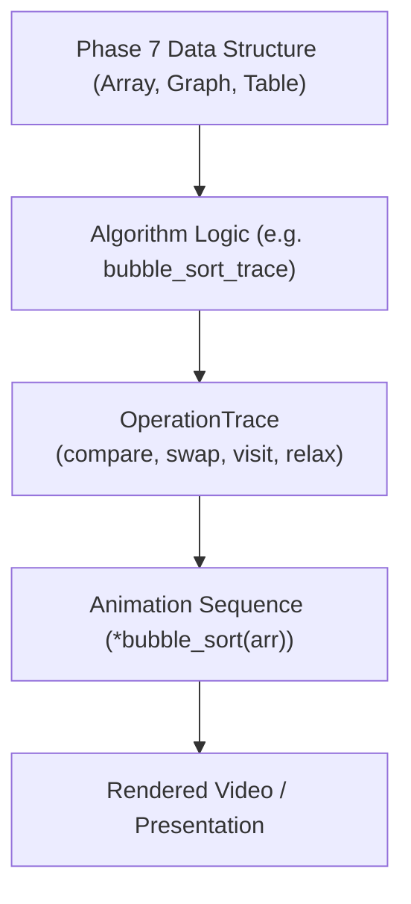

# Animora Algorithm Animations (Phase 8 Reference)

## 1. Overview & OperationTrace Architecture

Animora's algorithms engine (`animora.algorithms`) transforms computer science algorithms into educational animations. Built upon Phase 7's data structures, each algorithm produces an explicit **`OperationTrace`** record of atomic events (`COMPARE`, `SWAP`, `SET`, `VISIT_NODE`, `RELAX_EDGE`, etc.).



---

## 2. Algorithms Catalog

| Category | Function | Target Component | Big-O Time | Operation Pattern |
|---|---|---|---|---|
| **Search** | `binary_search` | `Array` | $O(\log N)$ | Repeated interval halving ($low, mid, high$). |
| **Sort** | `bubble_sort` | `Array` | $O(N^2)$ | Adjacent pair comparisons & bubble swaps. |
| **Sort** | `selection_sort` | `Array` | $O(N^2)$ | Minimum scanning followed by prefix swap. |
| **Sort** | `insertion_sort` | `Array` | $O(N^2)$ | Key selection & backwards element shifting. |
| **Sort** | `merge_sort` | `Array` | $O(N \log N)$ | Subarray divide-and-conquer and merge buffer writes. |
| **Sort** | `quick_sort` | `Array` | $O(N \log N)$ | Pivot partitioning and sub-range recursion. |
| **Traversal** | `bfs` | `Graph` | $O(V + E)$ | Level-order queue expansion. |
| **Traversal** | `dfs` | `Graph` | $O(V + E)$ | Deep branch recursive exploration. |
| **Pathfinding** | `dijkstra` | `Graph` | $O((V + E) \log V)$ | Uniform lowest-distance frontier relaxation. |
| **Pathfinding** | `a_star` | `Graph` | $O(E)$ | Heuristic-guided priority expansion ($f = g + h$). |
| **Dynamic Prog.** | `fibonacci_dp` | `Table` | $O(N)$ | Bottom-up memoization table fill. |
| **Backtracking** | `n_queens` | `Table` | $O(N!)$ | Candidate placement and conflict backtracking. |

---

## 3. Dijkstra vs A* Visual Differentiation

- **Dijkstra**: Expands outward uniformly based on cumulative edge distance $g(n)$, exploring cheap detours regardless of destination direction.
- **A\***: Uses a goal-directed heuristic $h(n)$ to prioritize nodes closer to the destination, pruning unpromising branches.

---

## 4. Usage Examples

### Visualizing Quick Sort

```python
from animora.core import Scene
from animora.datastructures import Array
from animora.algorithms import quick_sort

class QuickSortDemo(Scene):
    def construct(self):
        arr = Array([45, 12, 89, 33, 7, 56])
        self.play(*quick_sort(arr, run_time=0.4))
```

### Visualizing Dijkstra Shortest Path

```python
from animora.core import Scene
from animora.datastructures import Graph
from animora.algorithms import dijkstra

class DijkstraDemo(Scene):
    def construct(self):
        g = Graph(nodes=["A", "B", "C", "D"], edges=[("A", "B"), ("B", "D"), ("A", "C"), ("C", "D")])
        self.play(*dijkstra(g, start="A", target="D"))
```
