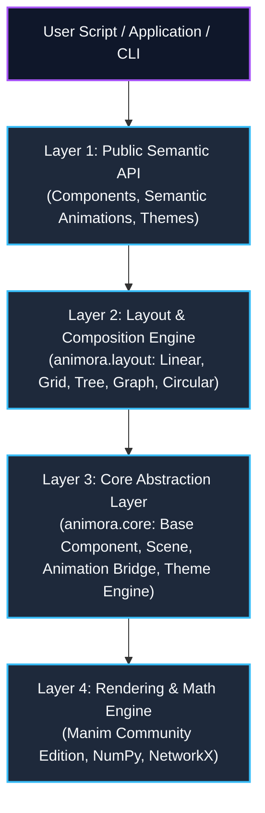
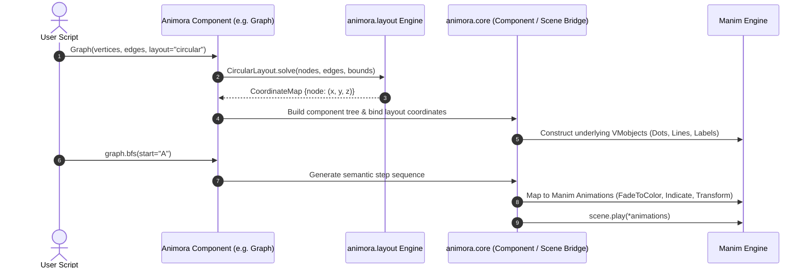

# Animora Architecture — Overview & System Design

## 1. Vision & Philosophy

**Animora** is a high-level, declarative animation framework built on top of [Manim](https://www.manim.community/) (Community Edition). Its purpose is to democratize the creation of high-quality educational, technical, mathematical, and algorithmic visualizations.

### The Seaborn Analogy
In the scientific Python ecosystem, **Matplotlib** provides pixel-level and primitive-level control for rendering plots, but building complex statistical visualizations directly with Matplotlib is verbose and error-prone. **Seaborn** sits on top of Matplotlib: it understands domain concepts like datasets, distributions, regressions, and hue groupings, letting users describe *what* statistical relationship to visualize while delegating low-level rendering to Matplotlib.

Animora adopts an identical philosophy for technical animation:

| Dimension | Low-Level Engine (Manim) | High-Level Abstraction (Animora) |
|---|---|---|
| **Core Abstraction** | `Mobject`, `VMobject`, `VectorField` | `Component`, `Scene`, `Layout`, `Theme` |
| **Mental Model** | Geometric coordinates & manual transforms | Semantic data structures & declarative operations |
| **Target Task** | Animating circles, arrows, and parametric curves | Visualizing BFS traversal on a Graph or sorting an Array |
| **API Style** | Imperative animation orchestration | High-level declarative intent + semantic action methods |
| **Escape Hatch** | N/A (it is the foundation) | First-class `.manim_object` property on every component |

---

## 2. Layered Architecture

Animora is structured into four distinct, strictly ordered architectural layers:

### Layer Breakdown

#### Layer 1: Public Semantic API (`animora.components`, `animora.animations`, `animora.theme`)
- **Responsibility**: Provides high-level, domain-specific visualization constructs.
- **Key Concepts**:
  - Primitives: `Text`, `Shape`, `Arrow`, `Connector`, `Group`, `Panel`.
  - Data Visualizations: `BarChart`, `LineChart`, `ScatterPlot`, `Histogram`, `Table`.
  - Data Structures: `Array`, `LinkedList`, `Stack`, `Queue`, `Heap`, `Tree`, `BinarySearchTree`, `Graph`, `HashTable`.
  - High-level operations: `graph.bfs(start="A")`, `array.swap(i, j)`, `tree.insert(value)`.
- **Constraint**: Must never interact directly with private Manim internals; all rendering passes through Layer 3 abstractions.

#### Layer 2: Layout & Composition Engine (`animora.layout`)
- **Responsibility**: Pure coordinate and spatial geometry calculation decoupled from visual rendering.
- **Key Concepts**: `HorizontalLayout`, `VerticalLayout`, `GridLayout`, `TreeLayout`, `GraphLayout`, `CircularLayout`, `FlowLayout`.
- **Constraint**: Layout algorithms compute spatial offsets, bounding boxes, and target transformations. They operate on abstract component bounding dimensions and node-edge topologies without instantiating Manim mobjects.

#### Layer 3: Core Abstraction Layer (`animora.core`)
- **Responsibility**: The foundational bridge linking Animora’s declarative world to Manim's imperative rendering pipeline.
- **Key Concepts**:
  - `Component`: Lifecycle, hierarchy, properties, bounds, and the `.manim_object` escape hatch.
  - `Scene`: Manim `Scene` subclass with automated camera management, layout anchoring, and component registration.
  - `Animation`: Bridge between Animora semantic operations and Manim `Animation`/`Transform` instances.
  - `Config` & `Registry`: Global runtime settings and plugin dispatch.

#### Layer 4: Rendering & Math Engine (External)
- **Responsibility**: Frame rasterization, vector rendering, ffmpeg video export, and matrix math.
- **Dependencies**: `manim` (Community Edition), `numpy`, `networkx`.

---

## 3. Component vs. Layout Boundary Resolution

### The Architectural Question
Should a `Component` know how to lay out its own children internally, or should layout logic live exclusively in a separate `animora.layout` engine that components consume?

### The Decision: Decoupled Pure Layout Engine
Animora adopts a **strict separation between Components (Visual Representation & Hierarchy) and Layouts (Pure Geometric Solvers)**.

1. **Components define WHAT**: A `Component` maintains its state, visual elements, child relationships, and exposes its measured dimensions (`width`, `height`, `depth`, `center`).
2. **Layouts compute WHERE**: A `Layout` class takes a collection of components (or a graph topology) and solves for their 2D/3D coordinate transformations.
3. **Application**: When a compound component (like `Tree` or `Array`) positions its sub-elements, it delegates spatial calculation to an explicit layout strategy (e.g. `ReingoldTilfordTreeLayout` or `FlexLinearLayout`).

### Rationale and Justification
- **Reusability**: The same `TreeLayout` algorithm can layout a `BinarySearchTree` component, an AST visualizer, or a flowchart without duplicating positioning logic.
- **Testability**: Layout algorithms are pure mathematical functions operating on bounding boxes and adjacency lists. They can be 100% unit-tested with lightweight mock geometry without initializing Manim rendering contexts or OpenGL/cairo backends.
- **Extensibility**: Users and plugin authors can implement custom layouts (e.g., custom force-directed or physics-based positioning) and apply them to any existing Animora components without subclassing the components.

### Rejected Alternative: Component-Embedded Layouts
- *Why Rejected*: Embedding layout calculations inside component classes leads to bloated base classes, code duplication across components (e.g. linear positioning repeated in `Array`, `Stack`, and `Queue`), and makes it impossible to swap layout algorithms dynamically at runtime.

---

## 4. Execution Flow: From Script to Rendered Frame

---

## 5. Architectural Principles

1. **Declarative First, Imperative When Needed**: High-level semantic calls (`array.sort()`, `graph.dijkstra()`) produce clean, timed animation sequences automatically, but every step is customizable.
2. **Zero-Magic Escape Hatch**: Animora never hides Manim. Every component exposes its underlying Manim object directly via `.manim_object`, allowing seamless mixing of Animora components with native Manim animations.
3. **Stateless Layout Solvers**: Layout calculations do not mutate global scene state. They take bounding geometries and graph topologies as input and return coordinate mappings.
4. **Theme Driven Design**: Visual styling (colors, strokes, typography, timing) is abstracted into design tokens via `animora.theme`, ensuring consistent, publication-ready aesthetics by default.

---

## 6. Consistency Self-Check

This architecture specification has been validated across all five Phase 0 documents:

- **Layer Names**: Layer 1 (Public Semantic API), Layer 2 (Layout & Composition Engine), Layer 3 (Core Abstraction Layer), Layer 4 (Rendering & Math Engine).
- **Module Names**: `animora.core`, `animora.components`, `animora.layout`, `animora.theme`, `animora.animations`, `animora.cli`.
- **Base Class & Escape Hatch**: `Component`, `.manim_object`.
- **Target Python Floor**: Python `>= 3.10`.
- **Target Manim Range**: `manim >= 0.18.0, < 1.0.0`.
