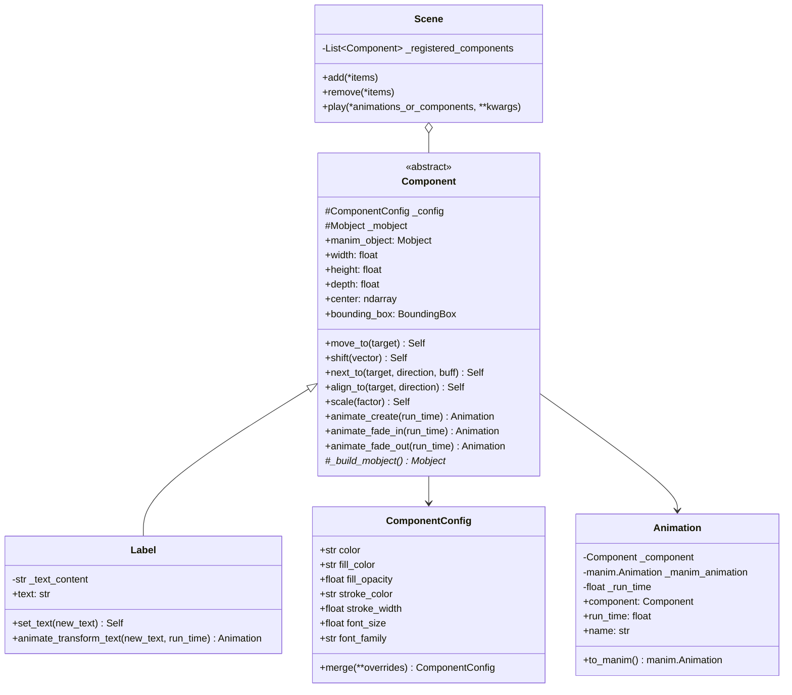

# Animora Architecture — Core Abstractions (Phase 2 Reference)

## 1. Overview & Purpose

Phase 2 introduces the foundational class hierarchy for **Animora**, establishing the core bridge between high-level declarative components and Manim's imperative rendering engine.



---

## 2. Class Contracts & Specifications

### `animora.core.Component`
The abstract base class for all visual components.
- **Escape Hatch**: `@property def manim_object(self) -> manim.Mobject` lazy-builds and caches the underlying Manim `Mobject`/`VMobject`.
- **Geometry**: `width`, `height`, `depth`, `center`, and `bounding_box` (`BoundingBox`) provide measured coordinates for layout engines.
- **Positioning**: Fluent methods (`move_to`, `shift`, `next_to`, `align_to`, `scale`) mutate the underlying Manim mobject and return `self`.
- **Lifecycle**: Subclasses implement `_build_mobject() -> manim.Mobject`.

### `animora.core.Scene`
Extends `manim.Scene`:
- Tracks registered `Component` instances.
- Automatic unwrapping in `add()` and `remove()`.
- Enhanced `play()` method that accepts `Animation`, `Component` (auto-fades in), or native Manim `Animation`.

### `animora.core.Animation`
Bridges semantic animation intent to Manim:
- Carries target `component`, `run_time`, `rate_func`, and descriptive `name`.
- `.to_manim()` produces the configured `manim.Animation` instance.

### `animora.core.ComponentConfig`
Immutable/mergeable configuration dataclass holding basic visual styling attributes: `color`, `fill_color`, `fill_opacity`, `stroke_color`, `stroke_width`, `font_size`, `font_family`.

### `animora.components.Label`
The reference primitive demonstrating full stack integration:
- Renders text via Manim's `Text`.
- Supports dynamic `set_text()` and `animate_transform_text()`.

---

## 3. The Escape Hatch in Practice

```python
from animora.core import Scene
from animora.components import Label
import manim

class CustomScene(Scene):
    def construct(self):
        # 1. High-level Animora component
        label = Label("Hello, Animora!", color="#38BDF8")
        
        # 2. Add via high-level animation
        self.play(label.animate_fade_in(run_time=1.0))
        
        # 3. Escape hatch to native Manim
        label.manim_object.shift(manim.UP)
        self.play(manim.Wiggle(label.manim_object))
```
