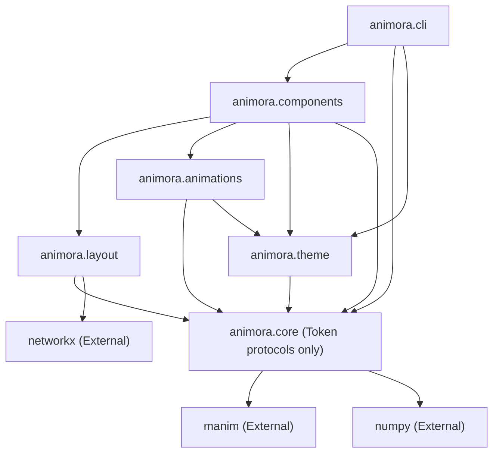

# Animora Architecture — Module Boundaries & Responsibilities

## 1. Package Structure Overview

Animora is organized into six top-level subpackages under the root `animora` namespace:

```
animora/
├── __init__.py               # Public package exports and global theme/config convenience functions
├── core/                     # Core abstraction layer: Component, Scene, Animation bridge, Registry
├── components/               # Concrete visual components (primitives, charts, data structures)
│   ├── primitives/           # Text, Shape, Arrow, Connector, Group, Panel
│   ├── dataviz/              # BarChart, LineChart, ScatterPlot, Histogram, Table
│   └── dsa/                  # Array, LinkedList, Stack, Queue, Heap, Tree, Graph, HashTable
├── layout/                   # Pure layout & geometric solver engine (no rendering code)
├── theme/                    # Design token system, color palettes, typography, built-in themes
├── animations/               # Semantic animation primitives (traverse, highlight, swap, step)
└── cli/                      # Command-line interface (new, preview, render, doctor)
```

---

## 2. Module Responsibility Statements

### `animora.core`
**Responsibility**: Defines the foundational base classes and runtime lifecycle that connect Animora’s declarative world to Manim's rendering pipeline. It provides the base `Component` class (lifecycle, hierarchy, transformation, property observation, and the `.manim_object` escape hatch), the base `Scene` wrapper (camera, coordinate grid, and automatic layout anchoring), the `AnimationBuilder` interface, and the internal registry that manages plugin extensions and global engine configuration.

### `animora.components`
**Responsibility**: Implements all user-facing domain components, providing intuitive construction, state representations, and semantic animation methods. It organizes components into three primary families: visual primitives (`primitives/`), data visualizations (`dataviz/`), and computer science data structures (`dsa/`). Each component translates high-level domain state into Manim vector objects while delegating spatial placement to `animora.layout` and visual styling to `animora.theme`.

### `animora.layout`
**Responsibility**: Serves as a pure geometric solver engine responsible for computing spatial coordinates, bounding boxes, and alignment vectors for collections of visual elements. It contains mathematical algorithms for linear layouts (horizontal/vertical flex), grid matrices, circular arrangements, hierarchical tree layouts (e.g., Reingold-Tilford), and graph topologies (e.g., spring/force-directed, circular, planar). It contains zero rendering logic and operates strictly on geometric bounds and topological graphs.

### `animora.theme`
**Responsibility**: Manages the complete design token and styling system, ensuring beautiful, accessible, and mathematically sound default aesthetics across all Animora scenes. It defines color palettes, typography tokens, stroke widths, opacity levels, and animation timing curves. It provides built-in theme definitions (e.g., `ModernDark`, `PaperLight`, `Cyberpunk`, `Monokai`) and allows users to define custom themes or modify individual tokens globally or per-component.

### `animora.animations`
**Responsibility**: Implements semantic, high-level animation actions that represent domain-level transitions rather than raw geometric transforms. This includes operations such as highlighting nodes, swapping array indices, traversing tree paths, inserting/deleting elements, and step-by-step state transitions. It maps these domain intents to synchronized batches of Manim animation primitives (`Transform`, `FadeToColor`, `Indicate`, `MoveAlongPath`).

### `animora.cli`
**Responsibility**: Provides the user-facing command-line tool (`animora`) for project scaffolding, interactive live previewing, headless batch rendering, and environment health checks. It manages project templates, integrates with local Manim installations and ffmpeg pipelines, and provides diagnostic tooling (`animora doctor`) to verify LaTeX, cairo/Pango, and hardware acceleration availability.

---

## 3. Dependency Hierarchy (Directed Acyclic Graph)

To maintain strict separation of concerns and prevent circular dependencies, imports between modules must strictly respect the following Directed Acyclic Graph (DAG):



### Import Rules & Invariants
1. **`animora.layout` is leaf-adjacent**: It must NEVER import from `animora.components` or `animora.animations`. It only consumes abstract bounding boxes and layout protocol interfaces from `animora.core`.
2. **`animora.theme` is standalone**: It must NEVER import from `animora.components` or `animora.layout`.
3. **`animora.core` has no upward imports**: It never imports from `components`, `layout`, `theme`, `animations`, or `cli`.
4. **`animora.components` is the integrator**: It composes `core`, `layout`, `theme`, and `animations` to present the unified semantic API.

---

## 4. Extensibility Seams & Plugin Entry Points

To ensure the package architecture supports future expansion (such as domain-specific plugins like `animora-physics` or `animora-circuits`) without breaking changes, the following Python `entry_points` groups are reserved:

| Entry Point Group | Purpose | Target Interface |
|---|---|---|
| `animora.plugins` | Third-party extension packages registering custom components or features | `animora.core.plugin.Plugin` |
| `animora.themes` | Third-party theme packages contributing color palettes and style packs | `animora.theme.Theme` |
| `animora.layouts` | Custom layout algorithms (e.g. specialized physics/force solvers) | `animora.layout.LayoutStrategy` |

These hooks will be discovered dynamically at runtime via `importlib.metadata.entry_points(group="animora.plugins")` inside `animora.core.registry`.
