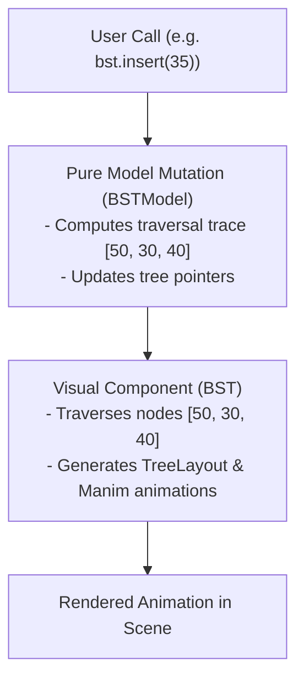

# Animora Data Structures (Phase 7 Reference)

## 1. Overview & Dual-Correctness Pattern

Animora's data structures package (`animora.datastructures`) powers stateful, algorithm-aware educational animations. Every component strictly isolates its **pure Python mathematical data model** from its **visual and animation rendering layer**.



---

## 2. Supported Data Structures

| Structure | Model Class | Visual Component | Key Animated Operations |
|---|---|---|---|
| **Array** | `ArrayListModel` | `Array` | `animate_swap(i, j)`, `animate_highlight(i)`, `animate_set(i, val)` |
| **Stack** | `StackModel` | `Stack` | `animate_push(val)`, `animate_pop()`, `animate_peek()` |
| **Queue** | `QueueModel` | `Queue` | `animate_enqueue(val)`, `animate_dequeue()`, `animate_peek()` |
| **LinkedList** | `LinkedListModel` | `LinkedList` | `animate_insert_head(val)`, `animate_insert_tail(val)` |
| **Heap** | `HeapModel` | `Heap` | `animate_insert(val)`, `animate_extract()` |
| **Tree** | `GenericTreeModel` | `Tree` | `animate_highlight_node(node_id)` |
| **BST** | `BSTModel` | `BST` | `animate_insert(val)`, `animate_search(val)`, `animate_delete(val)` |
| **Graph** | `GraphModel` | `Graph` | `animate_highlight_node(u)`, `animate_mark_visited(u)`, `animate_highlight_edge(u, v)` |
| **HashTable** | `HashTableChainingModel` | `HashTable` | `animate_insert(key, val)`, `animate_search(key)` |

---

## 3. Structural Design Decisions

### HashTable Collision Strategy: Separate Chaining
- **Strategy**: Each bucket index maintains a linked chain of colliding key-value pairs.
- **Justification**: Separate chaining provides the most transparent 2D visual representation for teaching hash table collisions.

### Binary Search Tree Scope
- Standard unbalanced BST (insertions, searches, and all 3 deletion cases: leaf, 1-child, 2-children with in-order successor).
- Rebalancing (AVL/Red-Black) is reserved for dedicated balanced tree phases.

---

## 4. Usage Examples

### Binary Search Tree (BST)

```python
from animora.core import Scene
from animora.datastructures import BST

class BSTDemo(Scene):
    def construct(self):
        bst = BST([50, 30, 70, 20, 40])
        # Traverses [50, 30, 40] before placing 35:
        self.play(bst.animate_insert(35))
        # Highlights search path:
        self.play(bst.animate_search(35))
        # Deletes node with 2 children:
        self.play(bst.animate_delete(30))
```

### Graph State Primitives (Foundation for Phase 8 Algorithms)

```python
from animora.core import Scene
from animora.datastructures import Graph

class GraphDemo(Scene):
    def construct(self):
        g = Graph(nodes=["A", "B", "C"], edges=[("A", "B"), ("B", "C")])
        self.play(g.animate_highlight_node("A"))
        self.play(g.animate_highlight_edge("A", "B"))
        self.play(g.animate_mark_visited("B"))
```
