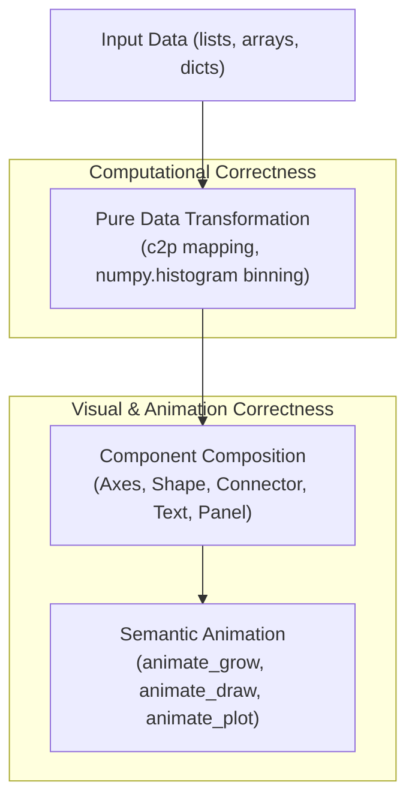

# Animora Data Visualization Components (Phase 6 Reference)

## 1. Overview & Dual-Correctness Architecture

Animora's data visualization module (`animora.dataviz`) provides high-level, animated visual components tailored for educational, technical, and algorithmic explanations.

Unlike general-purpose static plotting libraries, Animora enforces a **Dual-Correctness Architecture**:



---

## 2. Components Catalog

| Component | Class | Primary Composed Primitives / Layouts | Key Animation Methods |
|---|---|---|---|
| **`Axes`** | `animora.dataviz.Axes` | Manim `Axes`, theme tokens | `animate_create()` |
| **`BarChart`** | `animora.dataviz.BarChart` | `Axes`, `Shape.rounded_rectangle`, `Text` | `animate_grow()`, `animate_highlight_bar()` |
| **`LineChart`** | `animora.dataviz.LineChart` | `Axes`, `Connector`, `Shape.circle` | `animate_draw()` |
| **`ScatterPlot`** | `animora.dataviz.ScatterPlot` | `Axes`, `Shape.circle` | `animate_plot()` |
| **`Histogram`** | `animora.dataviz.Histogram` | `Axes`, `Shape.rectangle`, NumPy binning | `animate_grow()` |
| **`Table`** | `animora.dataviz.Table` | `GridLayout`, `Shape.rounded_rectangle`, `Text` | `animate_highlight_cell()` |

---

## 3. Usage Examples

### Bar Chart with Theming

```python
from animora.core import Scene
from animora.dataviz import BarChart
from animora.theme import Cyberpunk, use_theme

class BarChartDemo(Scene):
    def construct(self):
        with use_theme(Cyberpunk):
            chart = BarChart(
                data=[("MergeSort", 45), ("QuickSort", 30), ("BubbleSort", 120)],
            )
            self.play(chart.animate_grow(run_time=1.5))
```

### Table with Highlight Animation

```python
from animora.core import Scene
from animora.dataviz import Table

class TableDemo(Scene):
    def construct(self):
        table = Table(
            data=[["Linear Search", "O(N)"], ["Binary Search", "O(log N)"]],
            headers=["Algorithm", "Time Complexity"],
        )
        self.play(table.animate_create())
        self.play(table.animate_highlight_cell(row=2, col=1))
```
