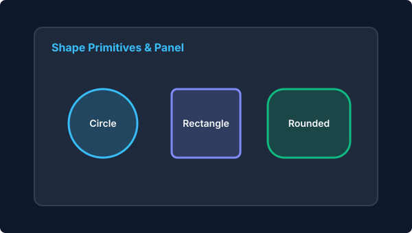
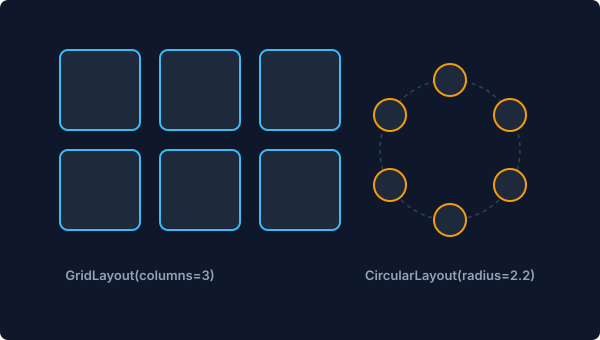
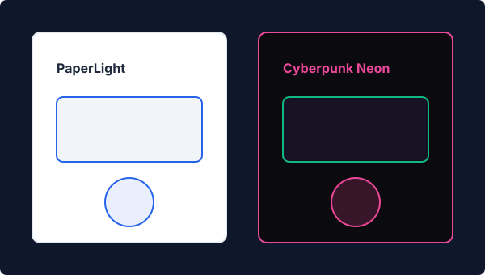
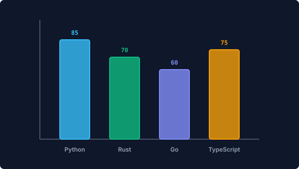
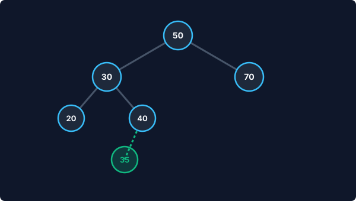
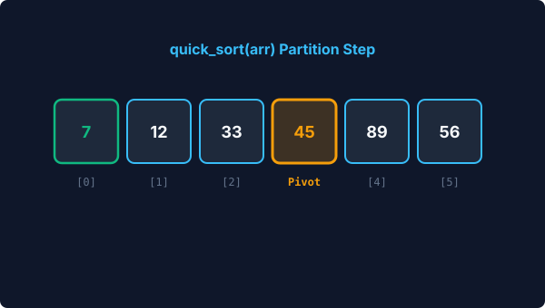
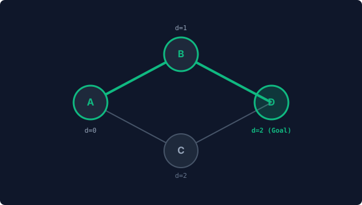

# 🎨 Visual Example Gallery & Showcase

A curated collection of complete, runnable example scenes across Animora's subsystems. Every example below includes its rendered visual output directly beside the declarative Python code that generated it.

---

## 1. Visual Primitives & Container Panels

Demonstrates `Text`, `Shape.circle`, `Shape.rounded_rectangle`, `Panel`, and semantic animations (`animate_fade_in`, `animate_create`, `animate_highlight`).

=== "Visual Output"
    <div style="max-width: 600px; margin: 1rem 0; border-radius: 8px; overflow: hidden; border: 1px solid rgba(56, 189, 248, 0.3);">
      
    </div>

=== "Python Code"
    ```python
    from animora.core import Scene
    from animora.components import Text, Shape, Panel
    from animora.theme import ModernDark, use_theme

    class BasicsAndShapesScene(Scene):
        def construct(self) -> None:
            with use_theme(ModernDark):
                title = Text("Animora Visual Primitives", font_size=38)
                title.move_to([0, 3.0, 0])

                circle = Shape.circle(radius=0.6, fill_color="#38BDF8").move_to([-3.0, 0.5, 0])
                rect = Shape.rectangle(width=1.8, height=1.2, fill_color="#818CF8").move_to([0.0, 0.5, 0])
                rounded = Shape.rounded_rectangle(width=1.8, height=1.2, corner_radius=0.2, fill_color="#10B981").move_to([3.0, 0.5, 0])

                panel = Panel(circle, rect, rounded, title="Shape Primitives").move_to([0, 0.5, 0])

                self.play(title.animate_fade_in(run_time=0.5))
                self.play(panel.animate_create(run_time=0.8))
                self.play(circle.animate_highlight(run_time=0.5))
    ```

---

## 2. Automatic Layout Solvers (Grid & Circular)

Demonstrates automatic multi-element positioning via `GridLayout` and `CircularLayout` using `Group.arrange()`.

=== "Visual Output"
    <div style="max-width: 600px; margin: 1rem 0; border-radius: 8px; overflow: hidden; border: 1px solid rgba(56, 189, 248, 0.3);">
      
    </div>

=== "Python Code"
    ```python
    from animora.core import Scene
    from animora.components import Shape, Group
    from animora.layout import GridLayout, CircularLayout
    from animora.theme import ModernDark, use_theme

    class LayoutAndGroupingScene(Scene):
        def construct(self) -> None:
            with use_theme(ModernDark):
                circles = [Shape.circle(radius=0.4, fill_color="#38BDF8") for _ in range(6)]
                node_group = Group(*circles)

                # Arrange in a 2x3 Grid
                node_group.arrange(GridLayout(columns=3, col_spacing=0.4, row_spacing=0.4))
                self.play(node_group.animate_create(run_time=0.8))

                # Re-arrange into a Circle
                node_group.arrange(CircularLayout(radius=2.2))
                self.play(node_group.animate_transform(node_group, run_time=0.8))
    ```

---

## 3. Themes & Multi-Theme Scoping

Demonstrates `PaperLight` and `Cyberpunk` neon themes applied cleanly using `with use_theme()`.

=== "Visual Output"
    <div style="max-width: 600px; margin: 1rem 0; border-radius: 8px; overflow: hidden; border: 1px solid rgba(56, 189, 248, 0.3);">
      
    </div>

=== "Python Code"
    ```python
    from animora.core import Scene
    from animora.components import Text, Shape, Panel
    from animora.theme import PaperLight, Cyberpunk, use_theme

    class ThemesAndStylingScene(Scene):
        def construct(self) -> None:
            with use_theme(PaperLight):
                light_panel = Panel(Shape.rounded_rectangle(3.0, 1.5), title=Text("Paper Light")).move_to([-3.2, 0, 0])

            with use_theme(Cyberpunk):
                cyber_panel = Panel(Shape.rounded_rectangle(3.0, 1.5), title=Text("Cyberpunk Neon")).move_to([3.2, 0, 0])

            self.play(light_panel.animate_create())
            self.play(cyber_panel.animate_create())
    ```

---

## 4. Data Visualization (BarChart)

Demonstrates educational chart components with `animate_grow()` and `animate_highlight_bar()`.

=== "Visual Output"
    <div style="max-width: 600px; margin: 1rem 0; border-radius: 8px; overflow: hidden; border: 1px solid rgba(56, 189, 248, 0.3);">
      
    </div>

=== "Python Code"
    ```python
    from animora.core import Scene
    from animora.dataviz import BarChart
    from animora.theme import ModernDark, use_theme

    class DataVizChartsScene(Scene):
        def construct(self) -> None:
            with use_theme(ModernDark):
                chart = BarChart(
                    data=[("Python", 85), ("Rust", 70), ("Go", 60), ("TypeScript", 75)],
                    bar_width=0.7,
                )
                self.play(chart.animate_grow())
                self.play(chart.animate_highlight_bar(1, color="#10B981"))
    ```

---

## 5. Binary Search Tree (BST)

Demonstrates stateful tree insertions with path comparison tracing (`50 -> 30 -> 40 -> 35`).

=== "Visual Output"
    <div style="max-width: 600px; margin: 1rem 0; border-radius: 8px; overflow: hidden; border: 1px solid rgba(56, 189, 248, 0.3);">
      
    </div>

=== "Python Code"
    ```python
    from animora.core import Scene
    from animora.datastructures import BST
    from animora.theme import ModernDark, use_theme

    class BSTDataStructureScene(Scene):
        def construct(self) -> None:
            with use_theme(ModernDark):
                bst = BST([50, 30, 70, 20, 40])
                self.play(bst.animate_create())
                self.play(bst.animate_insert(35))
                self.play(bst.animate_search(35))
    ```

---

## 6. Sorting Algorithm Visualization (QuickSort)

Demonstrates Quick Sort partition and element swaps over an `Array` component driven by `OperationTrace`.

=== "Visual Output"
    <div style="max-width: 600px; margin: 1rem 0; border-radius: 8px; overflow: hidden; border: 1px solid rgba(56, 189, 248, 0.3);">
      
    </div>

=== "Python Code"
    ```python
    from animora.core import Scene
    from animora.datastructures import Array
    from animora.algorithms import quick_sort
    from animora.theme import ModernDark, use_theme

    class QuickSortAlgorithmScene(Scene):
        def construct(self) -> None:
            with use_theme(ModernDark):
                arr = Array([45, 12, 89, 33, 7, 56])
                self.play(arr.animate_create())
                self.play(*quick_sort(arr))
    ```

---

## 7. Shortest Path Search (Dijkstra)

Demonstrates shortest path exploration and relaxed edge highlights on a `Graph` component.

=== "Visual Output"
    <div style="max-width: 600px; margin: 1rem 0; border-radius: 8px; overflow: hidden; border: 1px solid rgba(56, 189, 248, 0.3);">
      
    </div>

=== "Python Code"
    ```python
    from animora.core import Scene
    from animora.datastructures import Graph
    from animora.algorithms import dijkstra
    from animora.theme import ModernDark, use_theme

    class DijkstraPathfindingScene(Scene):
        def construct(self) -> None:
            with use_theme(ModernDark):
                g = Graph(
                    nodes=["A", "B", "C", "D"],
                    edges=[("A", "B"), ("B", "D"), ("A", "C"), ("C", "D")],
                )
                self.play(g.animate_create())
                self.play(*dijkstra(g, start="A", target="D"))
    ```
