<div class="hero-container">
  <div class="hero-title">Animora</div>
  <div class="hero-tagline">
    The high-level, declarative animation framework built on Manim for computer science, mathematics, and technical storytelling.
  </div>
  
  <div class="hero-media-wrapper">
    
  </div>

  <div class="hero-install-box">
    <span>$ pip install animora</span>
  </div>
</div>

---

## ⚡ Value Proposition: Manim, Elevated

```python
from animora.core import Scene
from animora.datastructures import BST
from animora.theme import ModernDark, use_theme

class BSTDemoScene(Scene):
    def construct(self) -> None:
        with use_theme(ModernDark):
            # 1. Declaratively initialize a Binary Search Tree
            bst = BST([50, 30, 70, 20, 40])
            self.play(bst.animate_create())

            # 2. Insert with animated path tracing: 50 -> 30 -> 40 -> 35
            self.play(bst.animate_insert(35))

            # 3. Search target key with instant visual highlight
            self.play(bst.animate_search(35))
```

---

## 📦 What Makes Animora Distinct?

=== "🧩 Visual Primitives & Panels"
    High-level `Text`, `Shape`, `Connector`, `Arrow`, `Group`, and `Panel` primitives with semantic state animations (`animate_highlight`, `animate_transform`, `animate_create`).

=== "📐 Automatic Layout Solvers"
    Pure geometric layout engines (`Horizontal`, `Vertical`, `Grid`, `Circular`, `Tree`, `Graph`, `Flow`) that arrange components automatically with zero manual coordinate math.

=== "🎨 Design Tokens & Theming"
    Centralized design token themes (`ModernDark`, `PaperLight`, `Cyberpunk`, `Monokai`) with dynamic context resolution via `use_theme()`.

=== "📊 Data Visualization"
    Dual-correctness educational chart components: `Axes`, `BarChart`, `LineChart`, `ScatterPlot`, `Histogram`, and `Table`.

=== "🌳 CS Data Structures"
    Stateful structures pairing computational Python models with animation layers: `Array`, `Stack`, `Queue`, `LinkedList`, `Heap`, `Tree`, `BST`, `Graph`, `HashTable`.

=== "🔍 Algorithm Visualizations"
    Explicit `OperationTrace` event tracking for Search, 5 Sorting algorithms, BFS/DFS, Dijkstra, A*, DP, and Backtracking.

---

## 🗺️ Next Steps

- **[Installation Guide](getting-started/installation.md)** — Set up Animora, Python, and system media dependencies.
- **[Your First Scene](getting-started/first-scene.md)** — 5-minute linear tutorial for beginners.
- **[Example Gallery](examples/gallery.md)** — Browse visual output clips alongside copy-paste code.
- **[API Reference](reference/api.md)** — Full parameter signatures for all public classes and functions.
