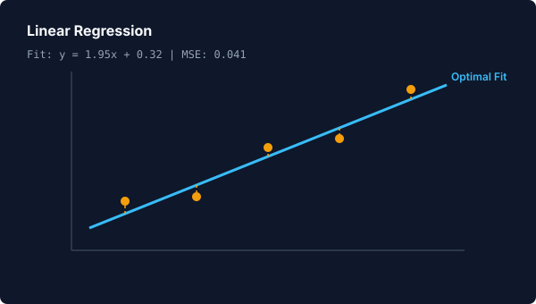
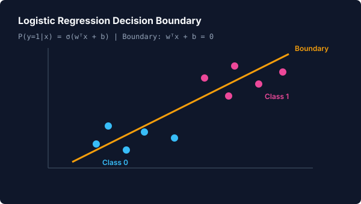
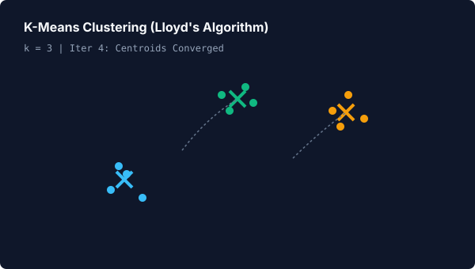
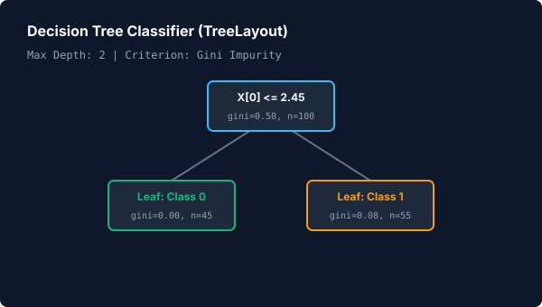
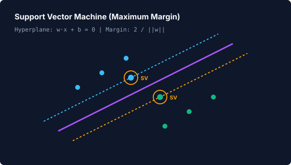
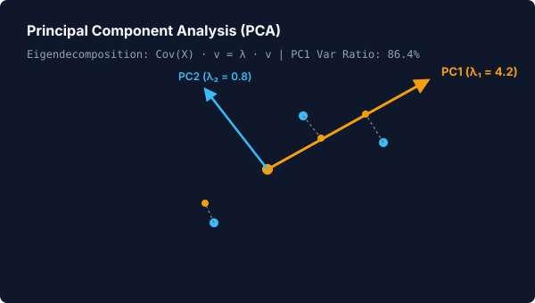

# 📊 Classic Machine Learning Visualizations

> **Learning Path Stage 2 of 4** &nbsp;•&nbsp; Previous: [Stage 1: Math Foundations](foundations.md) &nbsp;•&nbsp; Next: [Stage 3: Deep Learning](deep-learning.md)

Animora provides one-call visualizers for foundational machine learning algorithms. Every algorithm runs on pure NumPy data structures, traces exact mathematical steps, and renders without manual Manim choreography.

---

## 1. Linear Regression

Animora calculates the exact analytical least-squares fit $(X^T X)^{-1} X^T y$ and animates the regression line converging to the optimal fit:

=== "Visual Preview"
    <p align="center">
      
    </p>

=== "Python Code"
    ```python
    from animora.core import Scene
    from animora.ml.classic import linear_regression
    from animora.theme import ModernDark, use_theme

    class LinearRegressionDemo(Scene):
        def construct(self) -> None:
            with use_theme(ModernDark):
                x = [1.0, 2.0, 3.0, 4.0, 5.0]
                y = [2.2, 3.8, 6.1, 7.9, 10.2]

                # 1-Line: Animates axes, scatter points, and fitting line
                self.play(*linear_regression(x, y, steps=10))
    ```

---

## 2. Logistic Regression

Visualizes binary classification with sigmoid probability and cross-entropy gradient descent, showing the linear decision boundary $w^T x + b = 0$ settling between classes:

=== "Visual Preview"
    <p align="center">
      
    </p>

=== "Python Code"
    ```python
    from animora.core import Scene
    from animora.ml.classic import logistic_regression
    from animora.theme import ModernDark, use_theme

    class LogisticRegressionDemo(Scene):
        def construct(self) -> None:
            with use_theme(ModernDark):
                X = [[-2.0, -1.5], [-1.0, -2.0], [1.5, 1.0], [2.0, 2.2]]
                y = [0, 0, 1, 1]

                self.play(*logistic_regression(X, y, steps=12))
    ```

---

## 3. K-Means Clustering

Visualizes Lloyd's algorithm: centroid initialization, nearest-cluster sample recoloring, and centroid translation:

=== "Visual Preview"
    <p align="center">
      
    </p>

=== "Python Code"
    ```python
    from animora.core import Scene
    from animora.ml.classic import kmeans
    from animora.theme import ModernDark, use_theme

    class KMeansDemo(Scene):
        def construct(self) -> None:
            with use_theme(ModernDark):
                data = [[-3, -3], [-2.8, -3.2], [3, 3], [3.2, 2.8], [0, 3], [-0.5, 3.2]]

                self.play(*kmeans(data, k=3, max_iters=5))
    ```

---

## 4. Decision Tree Classifier

Constructs a binary classification tree using exact Gini impurity or Shannon entropy, rendered automatically via `TreeLayout` and styled `Panel` cards:

=== "Visual Preview"
    <p align="center">
      
    </p>

=== "Python Code"
    ```python
    from animora.core import Scene
    from animora.ml.classic import decision_tree
    from animora.theme import ModernDark, use_theme

    class DecisionTreeDemo(Scene):
        def construct(self) -> None:
            with use_theme(ModernDark):
                X = [[1.2, 0.5], [1.8, 0.7], [4.5, 3.2], [5.0, 3.8]]
                y = [0, 0, 1, 1]

                self.play(*decision_tree(X, y, max_depth=2, criterion="gini"))
    ```

---

## 5. Support Vector Machine (SVM)

Visualizes the maximum-margin hyperplane $w \cdot x + b = 0$, dashed margin boundaries $w \cdot x + b = \pm 1$, and highlights the exact support vectors:

=== "Visual Preview"
    <p align="center">
      
    </p>

=== "Python Code"
    ```python
    from animora.core import Scene
    from animora.ml.classic import svm
    from animora.theme import ModernDark, use_theme

    class SVMDemo(Scene):
        def construct(self) -> None:
            with use_theme(ModernDark):
                X = [[-2.0, 0.0], [-1.0, 1.0], [1.0, -1.0], [2.0, 0.0]]
                y = [-1, -1, 1, 1]

                self.play(*svm(X, y))
    ```

---

## 6. Principal Component Analysis (PCA)

Computes covariance eigendecomposition via `numpy.linalg.eigh`, draws principal component eigenvectors from the data centroid, and animates orthogonal projections onto the primary axis:

=== "Visual Preview"
    <p align="center">
      
    </p>

=== "Python Code"
    ```python
    from animora.core import Scene
    from animora.ml.classic import pca
    from animora.theme import ModernDark, use_theme

    class PCADemo(Scene):
        def construct(self) -> None:
            with use_theme(ModernDark):
                X = [[1.0, 1.2], [2.0, 1.9], [3.0, 3.1], [4.0, 3.8]]

                self.play(*pca(X, n_components=1))
    ```

---

## ⚠️ Common Pitfalls

1. **Non-Separable SVM Data**: The canonical `svm()` visualizer implements a hard-margin SVM. Providing heavily overlapping, non-linearly separable classes will prevent the margin from fully opening. For overlapping datasets, logistic regression is recommended.
2. **K-Means Degenerate Clusters**: Ensure the sample size $N$ is at least as large as the requested cluster count $k$.

---

## 🔗 Related Guides & API
- Previous: [Stage 1: Math Foundations](foundations.md)
- Next: [Stage 3: Deep Learning](deep-learning.md)
- API Reference: [`LinearRegressionModel`](../reference/api.md#animora.ml.LinearRegressionModel), [`KMeansModel`](../reference/api.md#animora.ml.KMeansModel), [`PCAModel`](../reference/api.md#animora.ml.PCAModel), [`HardMarginSVMModel`](../reference/api.md#animora.ml.HardMarginSVMModel)
