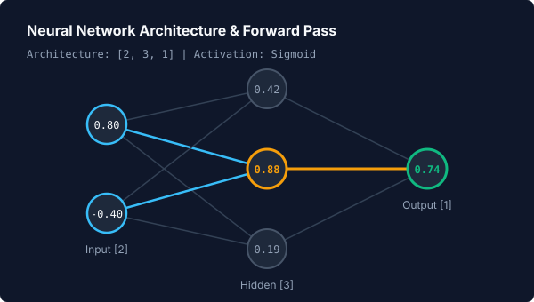
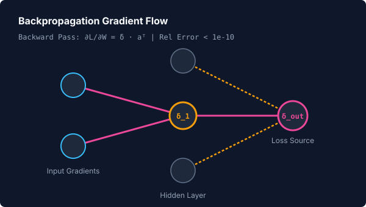
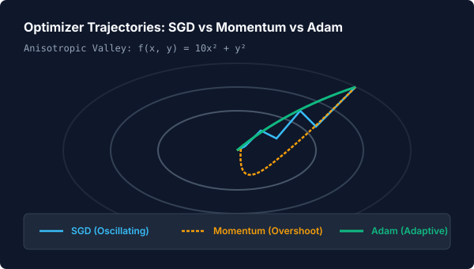
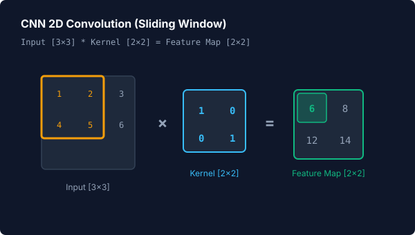
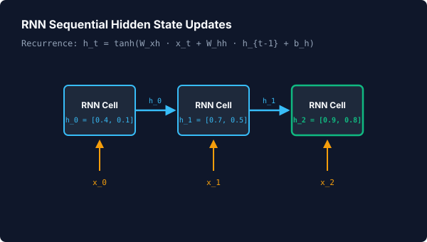

# 🧠 Deep Learning Visualizations

> **Learning Path Stage 3 of 4** &nbsp;•&nbsp; Previous: [Stage 2: Classic Machine Learning](classic-ml.md) &nbsp;•&nbsp; Next: [Stage 4: NLP & Attention](nlp-and-attention.md)

Animora provides one-call visualizers for foundational deep learning components. Every model computes real NumPy activations, exact analytical gradients, and tensor manipulations—verified against numerical ground truths without external framework dependencies.

---

## 1. Neural Network Structure & Forward Pass

Renders a multi-layer perceptron architecture and animates activations propagating layer-by-layer:

=== "Visual Preview"
    <p align="center">
      
    </p>

=== "Python Code"
    ```python
    from animora.core import Scene
    from animora.ml.deep_learning import neural_network_forward
    from animora.theme import ModernDark, use_theme

    class NeuralNetDemo(Scene):
        def construct(self) -> None:
            with use_theme(ModernDark):
                # Animates layered architecture and forward pass
                self.play(*neural_network_forward(
                    layer_sizes=[2, 3, 1],
                    input_data=[0.8, -0.4],
                    activation="sigmoid",
                ))
    ```

---

## 2. Backpropagation Gradient Flow

Computes analytical gradients $\frac{\partial \mathcal{L}}{\partial W}$ and $\frac{\partial \mathcal{L}}{\partial b}$ (verified against finite-difference gradient checks with relative error $< 10^{-10}$) and animates a reverse gradient wave flowing from the loss back to the inputs:

=== "Visual Preview"
    <p align="center">
      
    </p>

=== "Python Code"
    ```python
    from animora.core import Scene
    from animora.ml.deep_learning import NeuralNetworkModel, backpropagation
    from animora.theme import ModernDark, use_theme

    class BackpropDemo(Scene):
        def construct(self) -> None:
            with use_theme(ModernDark):
                net = NeuralNetworkModel(layer_sizes=[2, 3, 1], activation="sigmoid")

                # Animates forward pass followed by backward gradient flow
                self.play(*backpropagation(net, input_data=[0.6, 0.2], target_data=[1.0]))
    ```

---

## 3. Optimizers: SGD, Momentum, Adam

Animates optimization trajectories over non-convex or anisotropic loss surfaces, demonstrating the distinct physical characteristics of momentum inertia and adaptive coordinate moments:

=== "Visual Preview"
    <p align="center">
      
    </p>

=== "Python Code"
    ```python
    from animora.core import Scene
    from animora.ml.deep_learning import adam, momentum, sgd
    from animora.theme import ModernDark, use_theme

    def anisotropic_valley(x: float, y: float) -> float:
        return 10.0 * (x**2) + (y**2)

    class OptimizersDemo(Scene):
        def construct(self) -> None:
            with use_theme(ModernDark):
                # Compare optimizer dynamics on a shared loss surface
                self.play(*sgd(anisotropic_valley, start=(2.0, 2.0), steps=15))
                self.play(*momentum(anisotropic_valley, start=(2.0, 2.0), steps=15))
                self.play(*adam(anisotropic_valley, start=(2.0, 2.0), steps=15))
    ```

---

## 4. CNN 2D Convolution Operation

Visualizes a sliding window bounding box moving across an input matrix, computing elementwise dot products with the kernel, and populating the output feature map:

=== "Visual Preview"
    <p align="center">
      
    </p>

=== "Python Code"
    ```python
    from animora.core import Scene
    from animora.ml.deep_learning import cnn_convolution
    from animora.theme import ModernDark, use_theme

    class ConvolutionDemo(Scene):
        def construct(self) -> None:
            with use_theme(ModernDark):
                image = [
                    [1.0, 2.0, 3.0],
                    [4.0, 5.0, 6.0],
                    [7.0, 8.0, 9.0],
                ]
                kernel = [
                    [1.0, 0.0],
                    [0.0, 1.0],
                ]

                self.play(*cnn_convolution(image, kernel, stride=1))
    ```

---

## 5. RNN Sequential State Updates

Renders an unrolled recurrent neural network cell showing the hidden state recurrence relation $h_t = \tanh(W_{xh} x_t + W_{hh} h_{t-1} + b_h)$ across timesteps:

=== "Visual Preview"
    <p align="center">
      
    </p>

=== "Python Code"
    ```python
    from animora.core import Scene
    from animora.ml.deep_learning import rnn_forward
    from animora.theme import ModernDark, use_theme

    class RNNDemo(Scene):
        def construct(self) -> None:
            with use_theme(ModernDark):
                sequence = [
                    [1.0, 0.5],
                    [0.2, 0.8],
                    [-0.4, 0.1],
                ]

                self.play(*rnn_forward(sequence, hidden_dim=2))
    ```

---

## ⚠️ Scope Boundaries & Non-Goals

Animora deep learning visualizers are strictly scoped for pedagogical transparency:
- **No Production Framework Overheads**: Everything runs on transparent NumPy arithmetic without requiring CUDA or PyTorch.
- **Single-Pass Demonstrations**: Designed for single passes and demonstrative parameter updates rather than multi-epoch dataset loaders.
- **Attention & Transformers**: Handled in [Stage 4: NLP & Attention](nlp-and-attention.md).

---

## 🔗 Related Guides & API
- Previous: [Stage 2: Classic Machine Learning](classic-ml.md)
- Next: [Stage 4: NLP & Attention](nlp-and-attention.md)
- API Reference: [`NeuralNetworkModel`](../reference/api.md#animora.ml.NeuralNetworkModel), [`BackpropagationModel`](../reference/api.md#animora.ml.BackpropagationModel), [`CNNConvolutionModel`](../reference/api.md#animora.ml.CNNConvolutionModel), [`RNNCellModel`](../reference/api.md#animora.ml.RNNCellModel)
