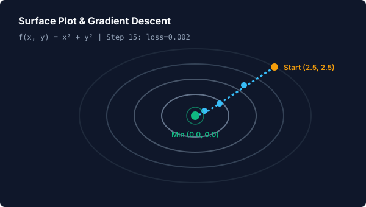
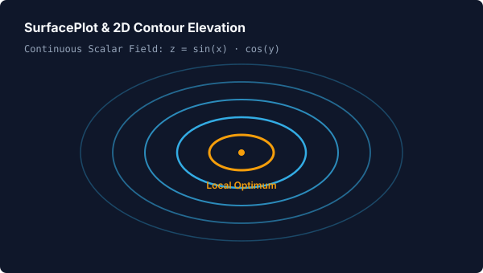
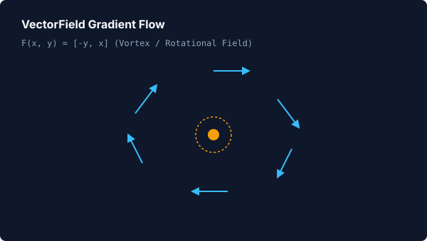
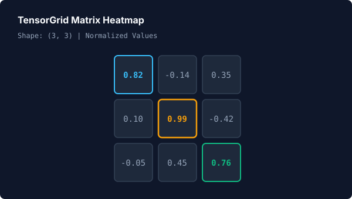

# 📐 Mathematical Foundations for Machine Learning

> **Learning Path Stage 1 of 4** &nbsp;•&nbsp; Next: [Stage 2: Classic Machine Learning](classic-ml.md)

Animora provides declarative, high-level primitives for visualizing machine learning optimization landscapes, contour elevations, vector flow fields, and multi-dimensional tensor heatmaps.

---

## 1. Gradient Descent Optimization

Animora executes exact numerical gradient descent on any user-provided 2D scalar loss function $f(x, y)$, recording step-by-step optimization diagnostics and rendering the descent trajectory over contour level curves in a single call:

=== "Visual Preview"
    <p align="center">
      
    </p>

=== "Python Code"
    ```python
    from animora.core import Scene
    from animora.ml import gradient_descent
    from animora.theme import ModernDark, use_theme

    class GradientDescentDemo(Scene):
        def construct(self) -> None:
            with use_theme(ModernDark):
                # Define 2D loss surface f(x, y)
                def loss(x: float, y: float) -> float:
                    return (x**2) + (y**2)

                # One-call: runs real numerical gradient descent and animates trajectory
                self.play(*gradient_descent(
                    loss,
                    start=(2.5, 2.5),
                    learning_rate=0.1,
                    steps=25,
                ))
    ```

---

## 2. Mathematical Primitives

### `SurfacePlot`
Renders 2D contour maps from scalar functions $f(x, y)$, automatically calculating iso-level curves and mapping data coordinates via `Axes`:

=== "Visual Preview"
    <p align="center">
      
    </p>

=== "Python Code"
    ```python
    from animora.ml import SurfacePlot

    def saddle(x: float, y: float) -> float:
        return (x**2) - (y**2)

    surface = SurfacePlot(saddle, x_range=(-3, 3, 1), y_range=(-3, 3, 1), num_contours=8)
    self.play(surface.animate_create())
    ```

---

### `VectorField`
Renders directional vector flows and gradient arrows over a regular 2D grid:

=== "Visual Preview"
    <p align="center">
      
    </p>

=== "Python Code"
    ```python
    from animora.ml import VectorField

    def rotational_field(x: float, y: float) -> tuple[float, float]:
        return -y, x

    vf = VectorField(rotational_field, x_range=(-2, 2, 1), y_range=(-2, 2, 1), step=0.5)
    self.play(vf.animate_create())
    ```

---

### `TensorGrid`
Renders 2D matrices, neural network weights, and attention heatmaps with automatic cell styling, value labeling, and cell highlight animations:

=== "Visual Preview"
    <p align="center">
      
    </p>

=== "Python Code"
    ```python
    import numpy as np
    from animora.ml import TensorGrid

    weights = np.array([[0.82, -0.14, 0.35], [0.10, 0.99, -0.42], [-0.05, 0.45, 0.76]])
    grid = TensorGrid(weights, title="Weight Matrix", cell_size=0.7)
    self.play(grid.animate_create())
    self.play(grid.animate_highlight_cell(1, 1))
    ```

---

## ⚠️ Common Pitfalls

1. **Learning Rate Divergence**: Setting an excessively large learning rate in `gradient_descent` (e.g. `learning_rate=2.0` on a steep quadratic) will cause the trajectory to explode beyond the coordinate bounds. Keep learning rates well conditioned (e.g. `0.01` to `0.2`).
2. **Surface Range Matching**: Ensure `start` is within the `x_range` and `y_range` of the rendered `SurfacePlot` so the optimization steps remain visible on screen.

---

## 🔗 Related Guides & API
- Continue to [Stage 2: Classic Machine Learning](classic-ml.md)
- Reference: [`GradientDescentModel`](../reference/api.md#animora.ml.GradientDescentModel), [`SurfacePlot`](../reference/api.md#animora.ml.SurfacePlot), [`TensorGrid`](../reference/api.md#animora.ml.TensorGrid)
