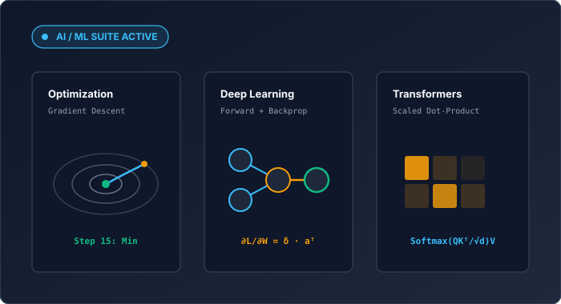

# 🤖 AI & Machine Learning Visualizations

Animora provides an extensible, declarative animation suite designed specifically for AI researchers, educators, and engineers. Every component executes on pure NumPy computational foundations, pairing rigorous mathematical models with cinematic Manim animations in a single line of code.

<p align="center" style="margin: 24px 0;">
  
</p>

---

## ⚡ The One-Call Philosophy

No manual mobject construction, no coordinate math, and no point-by-point timeline stitching. Animora's AI/ML visualizers handle data transformation, layout positioning, and animation generation in a single call:

```python
from animora.core import Scene
from animora.ml.deep_learning import neural_network_forward
from animora.theme import ModernDark, use_theme

class ShowcaseScene(Scene):
    def construct(self) -> None:
        with use_theme(ModernDark):
            # 1-Line: Architecture layout, synapses, and forward pass
            self.play(*neural_network_forward([2, 3, 1], [0.8, -0.4]))
```

---

## 🗺️ Recommended Learning Path

The AI/ML visualization suite is structured to follow the natural progression of modern AI engineering:

<div class="grid cards" markdown>

-   :material-chart-bell-curve-cumulative:{ .lg .middle } **1. Mathematical Foundations**

    ---

    Explore scalar loss surfaces, 2D contour elevations, vector flow fields, tensor heatmaps, and gradient descent optimization.

    [:octicons-arrow-right-24: Open Foundations Guide](foundations.md)

-   :material-chart-scatter-plot:{ .lg .middle } **2. Classic Machine Learning**

    ---

    Visualize analytical linear regression, logistic regression decision boundaries, K-Means clustering, decision trees, support vector machines, and PCA.

    [:octicons-arrow-right-24: Open Classic ML Guide](classic-ml.md)

-   :material-brain:{ .lg .middle } **3. Deep Learning**

    ---

    Animate multi-layer perceptron forward passes, backpropagation gradient waves (verified with finite differences), SGD/Momentum/Adam optimizers, CNN convolutions, and unrolled RNN cells.

    [:octicons-arrow-right-24: Open Deep Learning Guide](deep-learning.md)

-   :material-translate:{ .lg .middle } **4. NLP & Attention**

    ---

    Discover regex tokenization, 2D PCA projected word embeddings, scaled dot-product attention heatmaps, and minimal single-head transformer blocks.

    [:octicons-arrow-right-24: Open NLP & Attention Guide](nlp-and-attention.md)

</div>

---

## 📐 Dual-Correctness & Scope

Every visualizer in `animora.ml` is backed by a standalone mathematical model (`*Model`) that runs without Manim dependencies and records an immutable execution trace (`MLTrace`).

> [!NOTE]
> **Pedagogical Clarity Over Framework Clutter**:
> Animora's ML components are implemented in pure NumPy for maximum transparency and pedagogical clarity. No external deep learning frameworks (PyTorch, TensorFlow) or NLP toolkits are required.
