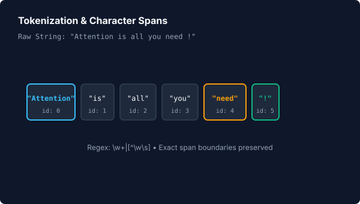
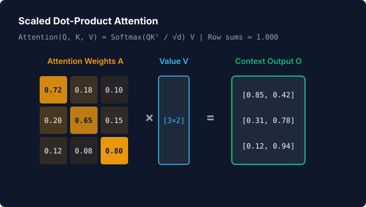
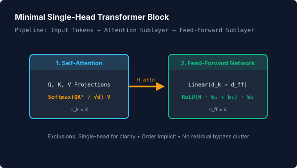

# 📖 NLP & Attention Visualizations

> **Learning Path Stage 4 of 4** &nbsp;•&nbsp; Previous: [Stage 3: Deep Learning](deep-learning.md) &nbsp;•&nbsp; Back to [Overview](index.md)

Animora provides one-call visualizers for Natural Language Processing (NLP) and modern Attention architectures. Every component computes real string splitting, PCA projections, and matrix multiplications using pure NumPy, without external NLP library dependencies.

---

## 1. Tokenization

Splits text into tokens and character spans, animating the text separating into distinct visual chip badges:

=== "Visual Preview"
    <p align="center">
      
    </p>

=== "Python Code"
    ```python
    from animora.core import Scene
    from animora.ml.nlp import tokenize
    from animora.theme import ModernDark, use_theme

    class TokenizationDemo(Scene):
        def construct(self) -> None:
            with use_theme(ModernDark):
                self.play(*tokenize("Attention is all you need !"))
    ```

---

## 2. Word Embeddings (with 2D PCA Projection)

Maps discrete tokens to vectors and projects the high-dimensional space down to 2D coordinates for visual plotting (reusing Phase 13b's `PCAModel` directly):

> [!WARNING]
> **Illustrative Embeddings Notice**:
> The embedding table in this component uses synthetic vectors for pedagogical visualization and does not represent pretrained semantic embeddings.

=== "Visual Preview"
    <p align="center">
      
    </p>

=== "Python Code"
    ```python
    from animora.core import Scene
    from animora.ml.nlp import word_embeddings
    from animora.theme import ModernDark, use_theme

    class EmbeddingsDemo(Scene):
        def construct(self) -> None:
            with use_theme(ModernDark):
                self.play(*word_embeddings(["king", "queen", "man", "woman"], embed_dim=4))
    ```

---

## 3. Scaled Dot-Product Attention

Computes linear projections $Q = X W_Q$, $K = X W_K$, $V = X W_V$, attention scores $\frac{Q K^T}{\sqrt{d_k}}$, and row-wise softmax normalization (strictly verified to sum to 1.0):

$$\text{Attention}(Q, K, V) = \text{softmax}\left(\frac{Q K^T}{\sqrt{d_k}}\right) V$$

=== "Visual Preview"
    <p align="center">
      
    </p>

=== "Python Code"
    ```python
    from animora.core import Scene
    from animora.ml.nlp import attention
    from animora.theme import ModernDark, use_theme

    class AttentionDemo(Scene):
        def construct(self) -> None:
            with use_theme(ModernDark):
                sequence_embeddings = [
                    [1.0, 0.2, -0.5],
                    [0.1, 0.9, 0.4],
                    [-0.3, 0.2, 0.8],
                ]
                self.play(*attention(sequence_embeddings, d_k=2))
    ```

---

## 4. Minimal Single-Head Transformer Block

Composes the self-attention mechanism with a non-linear feed-forward network ($H_{\text{ffn}} = \text{ReLU}(H_{\text{attn}} W_1 + b_1) W_2 + b_2$):

=== "Visual Preview"
    <p align="center">
      
    </p>

=== "Python Code"
    ```python
    from animora.core import Scene
    from animora.ml.nlp import transformer_block
    from animora.theme import ModernDark, use_theme

    class TransformerDemo(Scene):
        def construct(self) -> None:
            with use_theme(ModernDark):
                inputs = [[1.0, 0.5], [0.2, 0.8]]
                self.play(*transformer_block(inputs, d_k=2, d_ff=4))
    ```

---

## 📌 Deliberate Transformer Exclusions

To maximize pedagogical clarity and keep intermediate operations visually legible, the following components from production Transformer architectures are intentionally excluded:
- **Multi-Head Attention**: Excluded in favor of single-head attention so intermediate matrix transformations remain directly legible.
- **Positional Encoding**: Excluded as token positions are implicitly represented in the sequence index.
- **Layer Normalization**: Excluded so displayed numbers directly match raw matrix sums and dot products.
- **Residual / Skip Connections**: Excluded to avoid visual clutter and maintain clean linear stage transitions.

---

## 🏁 Phase 13 Completion Summary

With the completion of **Phase 13d**, Animora's entire AI/ML visualization suite is complete:
- [Stage 1: Mathematical Foundations](foundations.md)
- [Stage 2: Classic Machine Learning](classic-ml.md)
- [Stage 3: Deep Learning](deep-learning.md)
- [Stage 4: NLP & Attention](nlp-and-attention.md)
