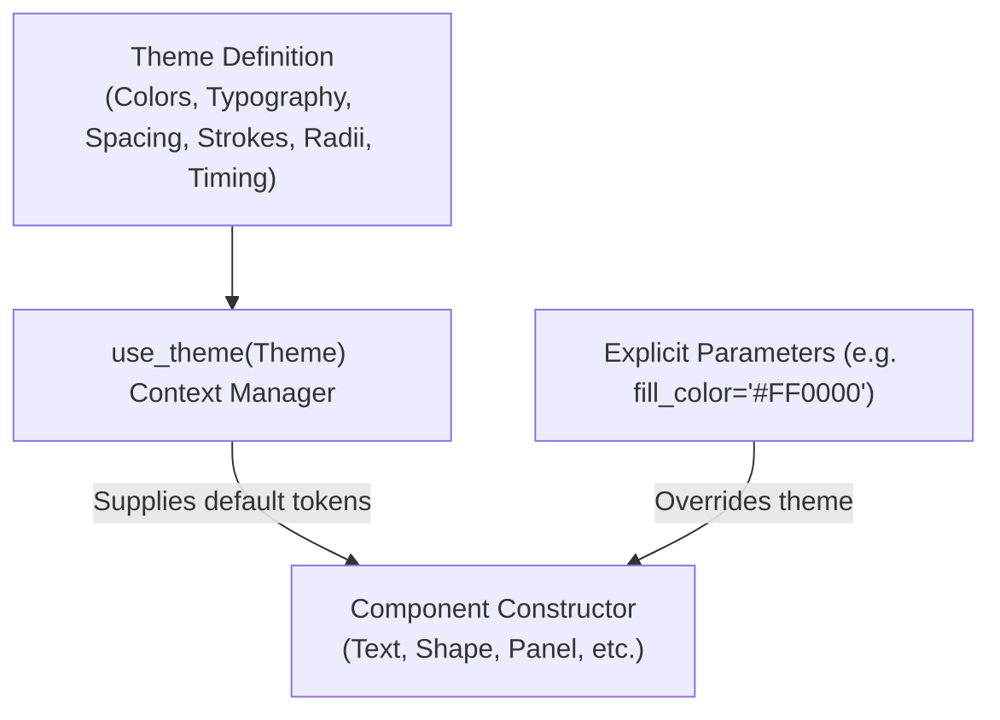

# Animora Theme & Design Token System (Phase 5 Reference)

## 1. Overview & Architecture

Animora features a complete design token and theme engine located under `animora.theme`. The theme system ensures that technical and algorithmic visualizations look publication-ready by default, while allowing effortless global theming and per-component customization.



---

## 2. Value Resolution Precedence Order

When an Animora component is constructed, its styling attributes are resolved in strict hierarchical order:

1. **Explicit Parameter**: Value passed directly to the component constructor (e.g., `Shape.circle(fill_color="#FF0000")`).
2. **Active Theme Context**: Token from the active theme set via `with use_theme(...)` or globally via `set_active_theme(...)`.
3. **Fallback Default**: Standard default from `ModernDark` (`DefaultTheme`).

---

## 3. Built-in Themes

Animora includes four professionally curated built-in themes:

| Theme | Description | Background | Primary | Accent |
|---|---|---|---|---|
| **`ModernDark`** *(Default)* | Sleek slate dark mode optimized for video. | `#0F172A` | `#38BDF8` (Sky) | `#F59E0B` (Amber) |
| **`PaperLight`** | High-contrast light mode for papers and white backgrounds. | `#FFFFFF` | `#2563EB` (Blue) | `#D97706` (Amber) |
| **`Cyberpunk`** | Neon high-contrast palette for tech animations. | `#0A0A0F` | `#EC4899` (Pink) | `#10B981` (Emerald) |
| **`Monokai`** | Developer-friendly code editor palette. | `#272822` | `#A6E22E` (Green) | `#F92672` (Magenta) |

---

## 4. Usage Examples

### Applying a Theme Globally or Locally

```python
from animora.core import Scene
from animora.components import Shape, Text, Panel
from animora.theme import PaperLight, Cyberpunk, use_theme

class ThemedDemoScene(Scene):
    def construct(self):
        # 1. Using Light Theme
        with use_theme(PaperLight):
            title = Text("Paper Light Mode")
            node1 = Shape.circle()

        # 2. Using Cyberpunk Theme with explicit override
        with use_theme(Cyberpunk):
            cyber_title = Text("Cyberpunk Mode")
            # Explicit override wins over theme:
            custom_node = Shape.circle(fill_color="#FFFFFF")

        self.play(title.animate_fade_in())
```

### Creating a Custom Theme

```python
from animora.theme import Theme, ModernDark

custom_theme = ModernDark.merge(
    name="solarized_dark",
    colors={
        "background": "#002B36",
        "surface": "#073642",
        "primary": "#268BD2",
        "accent": "#B58900",
        "text": "#839496",
    }
)
```
